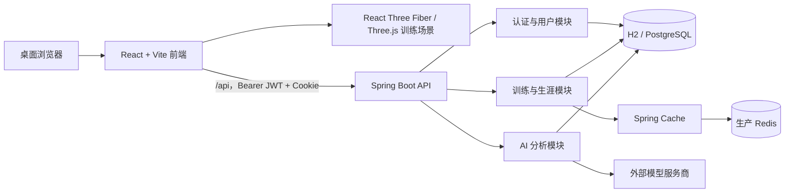

# NEON AIM 产品与项目说明

> 本文档描述 NEON AIM 当前的产品目标、功能边界、数据口径、系统架构、开发方式与已知限制。
> 内容以仓库当前实现为准；“已实现”“占位”“规划”会明确区分，避免把路线图当成现有能力。

## Register

`product`

## Platform

`web`

NEON AIM 当前面向桌面浏览器，训练交互以鼠标、Pointer Lock 和高刷新率 3D 渲染为核心。页面对中小屏提供布局降级，但移动触屏并不是当前主要训练场景。

## Users

主要用户：

- 希望通过可重复练习提升瞄准能力的 FPS 玩家。
- 希望查看单局细节、长期趋势和训练短板，而不只看一个最终分数的玩家。
- 需要在标准训练与自由练习之间切换，并比较同配置表现的玩家。

运营角色：

- 管理员负责配置外部 AI 服务商、模型和密钥，并验证模型连接。

## Product Purpose

NEON AIM 是一个以 GRID SHOT 为起点的浏览器端 FPS 瞄准训练平台。目前已在 GRID SHOT 上形成从训练、服务端保存、单局复盘、历史趋势到可选 AI 建议的基础闭环。

产品成功不只意味着训练画面能够运行，还意味着：

- 训练输入稳定、反馈及时、结算可信。
- 每个指标都能说明它的含义、口径和适用范围。
- 用户能从单局记录追溯到长期表现，而不是面对无法解释的综合分。
- 标准训练与自由练习都能生成结算；持久历史要求用户登录且记录通过后端校验，不同配置的原始分数不会被强行比较。
- 加载、离线、保存失败、权限不足和 AI 失败等状态会明确说明原因与下一步操作。

## Positioning

NEON AIM 的核心定位是“数据可追溯的刻意训练工具”，而不是只提供即时刺激的小游戏。

差异点包括：

- 从目标事件、单局汇总、历史记录到 AI 建议保留清晰的数据链路。
- 后端重新计算关键成绩，不直接信任浏览器提交的汇总值。
- 长期比较优先使用相同配置、相同版本的数据，避免错误结论。
- AI 只使用经过压缩和校验的结构化证据，不把全部原始事件直接塞进模型。
- 用户始终可以查看原始指标；AI 建议是辅助层，不替代基础数据。

## Brand Personality

- 精准：指标、单位、状态和结论都应有明确含义。
- 克制：减少装饰性卡片、重复标题和无意义的小字。
- 鼓励：指出问题时给出可执行建议，不用居高临下或制造焦虑的表达。

## Anti-references

产品明确避免以下设计和文案模式：

- 大量同质卡片堆叠，页面缺少主次关系。
- 标题区域过高、数据区域留白失衡，或跨页面标题基线不一致。
- 字号过小、对比度不足、数字与单位没有对齐。
- 同一含义重复出现，例如“最高分”和“标准训练最高分”同时占据视觉焦点。
- 没有解释的指标、英文缩写和内部字段名。
- 将不同训练配置的得分直接放在同一结论中比较。
- 只显示“出错了”，却不说明是网络、登录、权限、数据还是服务问题。
- “能力画像”“已确认的优势”“主要限制”等模板化、报告腔或明显的 AI 文案。
- 没有语义的炫光、渐变、红色警告和过度动画。

## Design Principles

1. **核心数据优先**：先回答用户最关心的问题，再展示辅助解释。
2. **只比较可比数据**：跨配置可以分别展示，但原始分数和速度趋势按配置、模式版本与计分版本分组。
3. **使用面向用户的语言**：优先使用自然中文或英文，不把内部字段和模型术语暴露给用户。
4. **状态必须明确**：加载、空数据、部分成功、离线、错误、过期和重试都应有独立表现。
5. **保持全局一致**：评级颜色、分页、返回逻辑、标题间距、数字精度和中英文切换采用统一规则。
6. **分析必须可追溯**：系统分析和 AI 建议都应能回到实际训练数据，不生成无证据的原因判断。

## Accessibility & Inclusion

当前项目尚未完成正式 WCAG 审计，也没有声明符合某个 WCAG 等级。以下是已经实现的基础支持，但尚未逐页、逐控件完成键盘和屏幕阅读器验证：

- 主要交互控件提供可见的 `:focus-visible` 状态和语义化 ARIA 属性。
- 加载与错误状态使用 `role="status"`、`role="alert"` 和 `aria-live`。
- 图标按钮提供可读标签，当前页和选中项提供状态语义。
- 当前关键弹窗、标签页、列表框和分页使用对应的可访问结构。
- 页面和训练流程支持常用键盘操作。
- 页面切换与界面动画尊重 `prefers-reduced-motion`。
- 中文和英文使用同一套状态与指标口径，切换语言时同步更新 `<html lang>`。
- 评级和错误不应只依赖颜色传达含义。

## 当前产品范围

| 领域 | 当前状态 | 说明 |
| --- | --- | --- |
| GRID SHOT 标准训练 | 已实现 | 固定 60 秒、中型目标、同时 3 个目标，进入标准训练比较口径。 |
| GRID SHOT 自由练习 | 已实现 | 可选择 30/60/90 秒、小/中/大型目标和部分视觉反馈。 |
| 单局结算与复盘 | 已实现 | 展示得分、准确率、TPM、命中间隔、稳定性、连击、阶段表现与得分构成。 |
| 账户与安全 | 已实现 | 注册、登录、刷新会话、改密、退出当前/全部设备、注销账户、资料和训练偏好。 |
| 生涯总览 | 已实现 | 汇总训练局数、时长、近 7 天活动和最近训练。 |
| GRID SHOT 训练记录 | 已实现 | 展示标准训练与自由练习趋势、能力数据、历史记录、分页和单局入口。 |
| 系统规则分析 | 已实现 | 基于真实训练事件和统计规则生成，不依赖外部模型。 |
| 单局与生涯 AI 分析 | 已实现，受条件限制 | 管理员完成 Provider 配置后，单局 AI 还要求登录且记录已保存；生涯 AI 至少需要 3 局有效记录。 |
| 训练库 | 部分实现 | 目录定义 31 个训练项目，当前只有 GRID SHOT 可玩。 |
| 生涯项目档案 | 部分实现 | 当前项目注册表只包含 GRID SHOT。 |
| 游戏成长计划 | 占位 | 当前只提供入口或预览，完整计划体系尚未完成。 |
| 工坊 | 占位 | 当前只有前端占位页面，尚无专用后端业务模块。 |
| 排行榜 | 占位/骨架 | 前端为占位页面，后端只预留了模块边界。 |
| 成就、通用任务、长期分析 | 后端骨架 | 已预留模块边界，尚无完整领域实现。 |

项目目前不是一个已完成的多项目训练平台。GRID SHOT 是唯一正式可玩的训练模式，也是当前数据、档案和 AI 分析能力的主要验证场景。

## 核心用户流程

### 训练流程

1. 用户可以从大厅直接开始 GRID SHOT，或在训练库选择 GRID SHOT；生涯项目档案中的“开始训练”当前会先进入训练库。
2. 选择标准训练，或配置自由练习时长与目标大小。
3. 训练状态依次经过 `ready → countdown → playing → paused/finishing → finished`。
4. 浏览器记录命中、失误、目标生命周期、连击、阶段数据和得分构成。
5. 结算页展示规则分析；登录用户完成训练后，前端尝试提交记录，由后端完成完整性校验、重算与保存。
6. 未登录用户可以查看本局结算，但待保存记录只保留在当前页面内存中；刷新或关闭页面前登录可以尝试补传，否则记录不会进入生涯历史。
7. 后端重新验证与计算成绩，保存记录并使相关生涯缓存失效。
8. 用户可以从结算页或生涯历史进入单局复盘；登录且记录已保存时可请求 AI 深度分析。

### 生涯流程

1. 生涯总览汇总跨项目训练局数、训练时长、近 7 天活动和最近训练。
2. 训练项目档案展示各项目的核心参与数据；GRID SHOT 当前展示累计训练、累计时长和标准训练最高分。
3. 进入 GRID SHOT 训练记录后，表现趋势按标准训练与所选自由练习配置分栏展示；历史记录使用同一分页列表，并逐条标注训练类型和配置。
4. 训练记录每页最多 10 条；不足 10 条时保持表格区域高度稳定，减少翻页时的页面跳动。
5. 点击某一局进入对应单局分析，返回时回到原生涯视图。

### 账户流程

1. Access Token 只保存在内存中，刷新会话依赖服务端 HttpOnly Cookie。
2. 首次登录后读取远端训练偏好；远端尚未配置时上传本地初始值。
3. 设备相关设置保存在本地，语言、灵敏度、准星和项目偏好可跟随账户同步。
4. 用户可修改密码、退出当前设备、退出全部设备或注销账户。

## GRID SHOT 规则与配置

### 标准训练

- 时长：60 秒。
- 目标大小：中型。
- 同时活动目标：3 个。
- 配置键：`grid-shot:60s:medium`。
- 当前模式版本：1。
- 当前计分版本：1。

“标准训练最高分”只统计完整性状态为 `VALID` 且类型为 `benchmark` 的记录。自由练习即使得分更高，也不会覆盖标准训练最高分。

### 自由练习

- 时长：30、60 或 90 秒。
- 目标大小：小型、中型或大型。
- 同时活动目标：3 个。
- 有效记录会进入历史，但趋势比较会保留配置边界。

### 可比性原则

以下字段一致时，记录才适合直接比较原始表现：

- `trainingId`
- `configurationKey`
- `modeVersion`
- `scoringVersion`

`sessionType` 当前是标准训练或自由练习的意图标签，不是底层配置可比性边界；当自由练习恰好使用 60 秒、中型目标时，它与标准训练具有相同的配置键。面向用户的趋势图仍按训练类型分栏，防止训练意图被混淆。

这个规则可以防止目标大小、训练时长、模式规则或计分规则变化后，旧分数与新分数被错误地画在同一结论里。

## 指标定义

| 指标 | 定义 | 使用注意 |
| --- | --- | --- |
| 得分 | 由基础命中、速度、连击和稳定性等计分项组成，并由后端按事件重算。 | 不同配置的原始得分不直接比较。 |
| 准确率 | `命中数 ÷（命中数 + 失误数）× 100%`。 | 刻意降速可提高准确率，因此不能单独代表综合能力。 |
| TPM | Targets Per Minute，每分钟击破目标数，即 `命中目标数 ÷ 训练分钟数`。 | 170 TPM 约等于平均每秒击破 2.83 个目标；该指标统计命中的目标，不统计所有点击尝试。 |
| 平均命中间隔 | 相邻有效命中的平均时间间隔。 | 数值越低通常代表切换更快，但仍需结合准确率。 |
| 稳定性 | 根据训练过程中的节奏波动计算的 0–100 指标。 | 用来描述输出是否均匀，不等同于准确率。 |
| 最高连击 | 单局连续命中且未被失误打断的最高次数。 | 长训练天然有更多累计机会，跨时长比较需谨慎。 |
| 评级 | 根据单局综合表现生成的等级。 | 评级颜色和规则在记录、结算和单局分析中保持一致。 |
| 标准训练最高分 | 所有有效标准训练记录中的最高得分。 | 不包含自由练习。 |
| 累计时长 | 当前项目全部记录时长之和，显示时按分钟或小时格式化。 | 用于参与度概览，不代表训练质量。 |

面向用户的训练分析数据会按指标语义格式化，通常不超过两位小数；灵敏度等配置项和开发诊断信息除外。AI 输出中的数字还会经过后端质量校验，避免出现无法由证据支撑的精度或数值。

## 生涯数据设计

### 项目注册机制

生涯系统通过项目注册表组织，不把 GRID SHOT 逻辑直接写死在总览页面。每个训练项目模块负责：

- 项目元数据与能力权重。
- 本地或远端数据加载。
- 标准训练判定。
- 生涯总览贡献。
- 项目档案与单局复盘渲染。

当前注册表只包含 GRID SHOT。未来新增项目时，应实现相同接口并注册，而不是继续在总览页面增加项目特例。

### 展示档案与 AI 历史口径

两个场景采用不同的数据读取策略：

- **展示档案**：最多读取最近 500 条记录，再从中筛选有效记录；随后按配置、模式版本和计分版本分组，选择记录最多的可比组计算能力档案。
- **生涯 AI**：数据库聚合覆盖全部有效历史；只把最近 6 局作为紧凑上下文，不传输全部原始事件。

因此，“页面趋势”和“AI 使用的全历史汇总”不是同一份明细列表，但都遵循可比性规则。

### 缓存与刷新

- 前端使用按“用户 ID + 项目 ID”区分的内存 LRU 缓存，最多保存 24 个项目数据集。
- 切换到生涯页面时可先显示缓存，再刷新远端数据。
- 当前生涯主视图和活动项目 ID 保存在 `sessionStorage`；刷新后可回到对应主视图或项目档案，但不会恢复滚动位置、分页或已打开的单局详情。
- 后端缓存 GRID SHOT 生涯档案；新增训练记录后主动清除对应用户缓存。
- 本地环境使用 Spring Simple Cache；生产环境使用 Redis，默认 TTL 为 10 分钟。

Redis 当前只用于 Spring Cache 的生涯档案缓存。训练详情、刷新令牌、AI 任务和 AI 结果并不会因为启用 Redis 就全部从 Redis 读取。

## AI 分析设计

### 分析目标

AI 分析不是聊天窗口，也不负责替用户编造训练故事。它的职责是：

- 结合全历史汇总和最近记录，描述当前训练表现。
- 找出有证据支撑的稳定项、短板和近期变化。
- 区分标准训练与自由练习，避免跨配置比较原始得分。
- 给出一个范围明确、可以在下一阶段执行的训练建议。
- 使用鼓励但克制的玩家语言，不输出模板化报告标题。

单局结算页目前仍保留一个禁用的 AI 对话预览；它不是可用的连续对话功能，当前实际能力仅包括结构化单局分析和生涯分析。

### 输入控制与 Token 策略

系统不会把全部历史记录或每次点击事件发送给模型：

1. 后端先在数据库中聚合全部有效历史。
2. 只保留受支持的指标、最多 6 个近期窗口和少量已验证信号。
3. 单局分析快照估算输入上限为 900 tokens，生涯分析快照为 1800 tokens。
4. Provider 调用还设有独立预算：单局最多 1,600 input / 1,200 output tokens，生涯最多 2,800 input / 1,400 output tokens；它比快照上限更高，用于容纳系统 Prompt 和输出协议。
5. 默认每个用户每天有 10,000 tokens 的进程内预算保护；调用前按最坏额度预留，完成后按 Provider 返回的实际用量结算，缓存命中不消耗额度。

这套设计让历史数量增长时，模型输入仍保持有界。需要注意：当前每日预算保护存储在进程内，多实例之间不共享，服务重启后会重置；它不是完整的分布式计费系统。

### 证据约束与质量门槛

模型只允许分析提供的结构化证据，不得推断：

- 疲劳、注意力或心态。
- 鼠标、显示器或其他硬件问题。
- 没有采集的鼠标轨迹或反应时间。
- 数据无法证明的因果关系。

模型结果会经过质量门槛检查，包括：

- 结论与证据中的事实数字必须能与输入快照中的数值对应；训练目标允许在受控步幅内由当前值派生。
- 用户可见文案中的数字最多保留两位小数。
- 生涯 AI 会校验各区块标题不重复；所有分析都禁止暴露内部字段名。
- 已存在的正向信号不能被完全忽略。
- 建议目标只能使用系统支持的指标，并限制为单阶段可实现的变化。
- 初次结果不合格时先本地修复，必要时最多再发起一次模型修复请求。

### 服务商与密钥

当前支持：

- OpenAI Responses API。
- DeepSeek OpenAI-compatible Chat API。
- 阿里百炼 OpenAI-compatible Chat API。

管理员在系统设置中保存服务商、模型和 API Key。API Key 使用由 `AI_CONFIGURATION_SECRET` 派生的 AES-GCM 密钥加密后存入数据库。该配置密钥在生产环境中必须稳定保存；变更后，旧的加密 API Key 将无法解密。

AI 分析结果使用数据库持久化缓存，而不是 Redis。缓存键由分析范围、数据版本、Prompt 版本和服务商等信息计算；数据版本、Prompt 版本、模型或服务商变化后，新请求不会命中旧缓存键。当前旧缓存行不会自动删除，生产环境仍需补充保留期或清理策略。

## 系统架构



### 仓库结构

```text
NEON-AIM/
├─ frontend/                     React + TypeScript 单页应用
│  ├─ public/                    静态资源
│  └─ src/
│     ├─ components/training/    训练 HUD、3D 场景与复盘组件
│     ├─ features/auth/          身份、账户 API 与账户工作区
│     ├─ features/career/        生涯聚合、项目注册、缓存与档案
│     ├─ game/                   规则、状态机、得分、输入与设置
│     └─ pages/                  训练、结算、生涯和设置页面
├─ backend/                      Java 21 + Spring Boot API
│  ├─ src/main/java/com/neonaim/
│  │  ├─ auth/                   登录、刷新与账户安全
│  │  ├─ user/                   用户资料与训练偏好
│  │  ├─ training/               训练记录、校验、规则分析与档案
│  │  ├─ ai/                     AI Provider、任务、缓存与质量门槛
│  │  ├─ common/                 API 响应与异常处理
│  │  └─ system/                 健康检查与系统端点
│  └─ src/main/resources/
│     └─ db/migration/           Flyway 数据库迁移
├─ LICENSE                       PolyForm Noncommercial 1.0.0
├─ README.md                     快速启动说明
└─ PRODUCT.md                    本文档
```

## 前端架构

### 技术栈

- React 19、TypeScript 6、Vite 8。
- Three.js、React Three Fiber、Drei：训练场景与目标渲染。
- Zustand：应用、身份和性能状态。
- Recharts：生涯趋势图。
- Framer Motion：页面与组件过渡。
- Lucide React、Simple Icons：图标。
- Vitest：单元与组件测试。
- Oxlint：静态检查。

样式使用普通 CSS，不依赖 Tailwind、CSS Modules 或 CSS-in-JS。

### 页面与导航

主要地址：

- `/`：启动页与大厅。
- `/training`：训练库。
- `/training/grid-shot`：GRID SHOT 训练。
- `/results/grid-shot`：单局结算与复盘。
- `/progress`：生涯总览与项目档案。
- `/workshop`：工坊占位页。
- `/ranking`：排行榜占位页。
- `/profile`：账户工作区。
- `/settings`：设置。
- `/dev/grid-shot-qa`：仅开发环境使用的 GRID SHOT QA 页面。

当前虽然安装了 `react-router-dom`，实际导航仍由 `history.pushState`、`popstate` 和路径映射维护，没有使用 Router 组件。

### 状态与数据持久化

- Access Token：只保存在当前页面内存。
- Refresh Session：由后端 HttpOnly Cookie 管理。
- 设备设置：保存在 `localStorage`。
- 当前生涯位置：保存在 `sessionStorage`。
- 登录用户训练记录：以后端为事实来源。
- 访客训练：仅在当前页面生命周期内暂存于内存；登录后尝试按顺序上传。
- 旧版浏览器训练历史与上传队列：启动时清理，不再作为长期事实来源。

### 国际化

项目内置轻量 `tx(chinese, english)` 文案接口，支持：

- `zh-CN`
- `en-US`

默认语言为中文。训练项目、目标大小、加载和错误状态等文案应始终通过同一接口切换，不应在中文页面残留 `large`、`medium` 等未经转换的展示值。

## 后端架构

### 技术栈

| 层级 | 技术 | 当前用途 |
| --- | --- | --- |
| 语言与构建 | Java 21、Gradle Kotlin DSL、Gradle Wrapper | 后端编译、测试、打包与严格 `-Xlint:all -Werror` 检查。 |
| 应用框架 | Spring Boot 4.1.0 | 自动配置、依赖管理与应用生命周期。 |
| Web 与校验 | Spring MVC、Bean Validation | REST API、请求绑定和请求体校验。 |
| 身份与安全 | Spring Security、OAuth2 Resource Server、JWT、BCrypt | Bearer Access Token、Refresh Session、角色权限和密码保护。 |
| 模块架构 | Spring Modulith 2.1 | 验证模块边界和命名接口。 |
| 数据访问 | Spring Data JPA、Hibernate | 用户、训练记录、AI 作业和缓存的关系数据持久化。 |
| 数据迁移 | Flyway | 管理 H2/PostgreSQL 表结构版本。 |
| 数据库 | 文件型 H2、PostgreSQL | 本地开发使用 H2，生产使用 PostgreSQL。 |
| 缓存 | Spring Cache、Redis | 本地使用进程内缓存；生产 Redis 当前只缓存生涯档案。 |
| JSON 与 HTTP | Jackson 3、Java 21 `HttpClient` | API JSON 映射，以及直接调用外部模型 HTTP API。 |
| 接口与运维 | Springdoc OpenAPI、Actuator | Swagger/OpenAPI 文档、health/info 端点。 |
| 测试 | JUnit 5、Spring Boot Test、MockMvc、Spring Modulith Test | 上下文、接口、领域流程和模块边界验证。 |

### AI 实现技术

- AI 层没有使用 Spring AI、LangChain 或模型厂商 SDK，而是通过项目自有的 `TrainingAnalysisProvider` 与 Provider Registry 隔离领域逻辑和外部模型协议。
- OpenAI 由 Java `HttpClient` 直连 Responses API，关闭服务商侧存储，并使用 Strict JSON Schema 限定返回结构。
- DeepSeek 与阿里百炼通过各自的 OpenAI-compatible Chat Completions 接口接入，使用 JSON Mode、低温度、非流式响应并关闭思考模式。
- HTTP 连接超时为 8 秒，单次请求超时为 30 秒；Jackson 3 负责请求快照和结构化结果的序列化与解析。
- 单局与生涯分析采用有界 `ThreadPoolTaskExecutor`：核心线程 1、最大线程 2、队列 32。它是应用内异步任务，不是消息队列或可跨重启续跑的分布式 Worker。
- AI 调用状态、Provider/模型、数据与 Prompt 版本、Token 用量、耗时、失败码和生涯结果由 JPA 持久化。AI 结果缓存位于关系数据库，不使用 Redis。
- 缓存键由 scope、source、data version、prompt version 和包含模型信息的 provider ID 计算 SHA-256；当前没有 TTL 或自动清理任务。
- Provider API Key 使用 `AES/GCM/NoPadding` 加密，密钥由稳定的 `AI_CONFIGURATION_SECRET` 经 SHA-256 派生；浏览器端只获取末四位提示。
- 当前没有向量数据库、Embedding、RAG、微调、本地模型推理、流式生成、WebSocket、分布式任务队列或分布式 Token 计费。

### 模块状态

| 模块 | 状态 | 职责 |
| --- | --- | --- |
| `auth` | 已实现 | 注册、登录、刷新、退出、密码与会话安全。 |
| `user` | 已实现 | 用户资料、角色、账户训练偏好。 |
| `training` | 已实现 | 训练提交、重算校验、查询、规则分析、生涯档案。 |
| `ai` | 已实现 | Provider 配置、单局/生涯分析、缓存、质量门槛和训练任务。 |
| `common` | 已实现 | 统一响应、业务错误和异常映射。 |
| `system` | 已实现 | 健康检查和系统信息。 |
| `analytics` | 骨架 | 尚无完整长期分析领域实现。 |
| `leaderboard` | 骨架 | 尚无完整排行榜实现。 |
| `achievement` | 骨架 | 尚无完整成就实现。 |
| `task` | 骨架 | 尚无通用任务实现；AI 训练任务位于 `ai` 模块。 |

Spring Modulith 测试负责验证模块边界。允许的跨模块能力通过命名接口暴露，避免领域代码随意引用其他模块内部实现。

## 训练记录完整性

后端不直接信任前端上传的 `score`、`accuracy` 或 `TPM`。GRID SHOT 提交会经过以下流程：

1. 校验客户端会话 ID，并以 `(user_id, client_session_id)` 保证幂等。
2. 校验训练 ID、配置键、训练类型、模式版本和计分版本。
3. 校验事件 ID、事件所属客户端会话、时间单调性、命中/失误与连击变化；提供目标激活时间时，继续校验目标存活时长。
4. 重算基础分、速度奖励、连击奖励、稳定性奖励和总分。
5. 重算命中数、失误数、准确率、TPM、平均命中间隔、稳定性和评级。
6. 校验连续分段、三个阶段窗口、分析信号和证据。
7. 同一事务中保存训练记录和规则分析。
8. 所有成功写入或确认的训练提交都会清除对应项目的生涯档案缓存。
9. 仅标准训练会尝试评估已采用的训练任务。

当前训练任务的查询与采用接口只向管理员开放，属于实验性管理能力；普通玩家的生涯 AI 分析不会自动创建可执行任务。若管理员已经为该账号采用任务，后续标准训练才会进行任务评估。

事件数量上限为 2,000；训练详情 JSON 和分析快照也有独立体积限制。列表查询使用轻量投影，不会在分页列表中加载全部事件 JSON。

## 数据库与缓存

### 本地环境

- 默认 Profile：`local`。
- 数据库：文件型 H2，启用 PostgreSQL 兼容模式。
- 默认路径：`backend/data/neonaim` 对应的 H2 文件。
- Spring Cache：进程内 Simple Cache。
- Redis 健康检查：关闭。

本地数据库会保留开发数据，并不是每次启动都会清空的内存库。

### 生产环境

- 数据库：PostgreSQL。
- 缓存：Redis，默认 TTL 10 分钟。
- 表结构：由 Flyway 迁移管理，JPA 使用 `ddl-auto=validate`。
- Refresh Token：只保存 SHA-256 哈希到数据库。
- AI 分析结果：持久化到 PostgreSQL 缓存表。

## 身份认证与安全

- API 使用 Bearer JWT，签名算法为 HS256，issuer 为 `neon-aim`。
- Access Token 默认有效期 15 分钟。
- Refresh Token 默认有效期 30 天，并在每次刷新时旋转。
- Refresh Cookie 使用 HttpOnly、SameSite=Strict 和 `/api/auth` Path；生产环境强制 Secure。
- 刷新与退出请求要求 `X-Requested-With: NEON-AIM`。
- 数据库只保存 Refresh Token 的 SHA-256 哈希。
- 已撤销 Refresh Token 被再次使用时，会撤销该用户全部刷新会话。
- 密码使用 BCrypt，cost 为 12。
- 连续 5 次密码错误会锁定账户 15 分钟。
- 修改密码会撤销其他会话；账户注销采用软删除和个人标识匿名化。
- 训练记录、档案和分析查询均按已认证用户隔离。

生产环境不能继续使用本地开发密钥。`AUTH_JWT_SECRET` 至少应为 32 个字符，并通过部署平台的 Secret 管理能力注入。

## API 概览

### 公共与系统

- `GET /api/health`
- `GET /actuator/health`
- `GET /api/v1/system/modules`
- `GET /v3/api-docs`
- `/swagger-ui`

### 认证与账户

- `POST /api/auth/register`
- `POST /api/auth/login`
- `POST /api/auth/refresh`
- `POST /api/auth/logout`
- `POST /api/auth/password`
- `POST /api/auth/logout-all`
- `DELETE /api/users/me`
- `GET /api/users/me`
- `PATCH /api/users/me`
- `GET /api/users/me/training-preferences`
- `PUT /api/users/me/training-preferences`

### 训练与生涯

- `POST /api/training/sessions`
- `GET /api/training/sessions`
- `GET /api/training/sessions/{sessionId}`
- `GET /api/training/sessions/{sessionId}/analysis`
- `GET /api/training/career/{trainingId}/profile`

训练列表支持 `trainingId`、从 0 开始的 `page` 和范围为 1–100 的 `size`。

### AI

- `POST /api/training/sessions/{sessionId}/ai-analysis`
- `GET /api/training/sessions/{sessionId}/ai-analysis`
- `POST /api/training/career/{trainingId}/ai-analysis`
- `GET /api/training/career/{trainingId}/ai-analysis`
- `GET /api/training/career/{trainingId}/coaching-task`
- `POST /api/training/career/{trainingId}/coaching-task`
- `GET /api/admin/ai/providers`
- `PUT /api/admin/ai/providers`
- `POST /api/admin/ai/providers/test`

AI Provider 管理和训练任务需要管理员权限。

除 `/api/health`、Actuator、OpenAPI/Swagger 等基础设施端点外，业务成功响应通常使用 `{ data, message }`。Controller 层捕获的业务异常、请求体校验、非法 JSON 和部分冲突会返回带机器可读 `code` 的 RFC 7807 `ProblemDetail`，字段校验错误另外包含 `fields`。安全过滤器产生的 401/403 以及路径或查询参数校验目前不承诺完全相同的错误结构。

## 环境要求

- Node.js 20.19 或更高的 Node 20 版本，或 Node.js 22.12 及以上。
- npm。
- Java 21。
- Git。
- 不需要全局安装 Gradle，仓库自带 Wrapper。

## 本地启动

### 1. 启动后端

Windows PowerShell：

```powershell
cd backend
.\gradlew.bat bootRun
```

macOS / Linux：

```bash
cd backend
./gradlew bootRun
```

默认地址：`http://127.0.0.1:3100`

后端健康检查：

```text
GET http://127.0.0.1:3100/api/health
```

### 2. 启动前端

另开一个终端。Windows PowerShell 推荐使用 `npm.cmd`，避免系统执行策略拦截 `npm.ps1`：

```powershell
cd frontend
npm.cmd ci
npm.cmd run dev
```

仓库已经包含 `package-lock.json`，普通开发启动应使用 `npm.cmd ci` 严格按锁文件安装。只有维护依赖版本时才使用 `npm.cmd install`。

Vite 通常使用 `http://localhost:5173`；端口被占用时可能自动变化，最终地址以终端输出为准。

Vite 开发服务器会把 `/api` 代理到 `http://127.0.0.1:3100`。

### PowerShell 的 npm 脚本错误

如果运行 `npm run dev` 时出现“禁止运行脚本”或 `PSSecurityException`，不需要修改全局执行策略，直接运行：

```powershell
npm.cmd run dev
```

注意命令是 `npm.cmd`，不是 `npm.`。

### 终止开发服务

在对应终端中按 `Ctrl + C`。如果后端 `bootRun` 已经失败并回到 PowerShell 提示符，则 Java 进程通常已经结束，不需要再次终止 Gradle 任务。

## 环境变量

### 前端

| 变量 | 必填 | 说明 |
| --- | --- | --- |
| `VITE_API_BASE_URL` | 否 | 后端 URL 前缀，例如 `http://127.0.0.1:3100`；接口路径自身已包含 `/api`。留空时使用同源请求，本地由 Vite 代理到 3100。 |

### 后端生产环境

| 变量 | 必填 | 说明 |
| --- | --- | --- |
| `SPRING_PROFILES_ACTIVE` | 是 | 生产环境设为 `prod`。 |
| `SERVER_PORT` | 否 | 默认 `3100`。 |
| `DATABASE_URL` | 是 | PostgreSQL JDBC URL。 |
| `DATABASE_USERNAME` | 是 | PostgreSQL 用户名。 |
| `DATABASE_PASSWORD` | 是 | PostgreSQL 密码。 |
| `REDIS_HOST` | 是 | Redis 主机。 |
| `REDIS_PORT` | 否 | 默认 `6379`。 |
| `REDIS_PASSWORD` | 视环境而定 | Redis 密码。 |
| `FRONTEND_ORIGIN` | 是 | 允许携带凭据访问 API 的前端 Origin。 |
| `AUTH_JWT_SECRET` | 是 | JWT 签名密钥，至少 32 个字符。 |
| `AI_CONFIGURATION_SECRET` | 强烈建议 | 加密 AI Provider API Key 的独立稳定密钥。代码会回退到 `AUTH_JWT_SECRET`，但生产环境不应共用。 |

`prod` Profile 已把 Refresh Cookie 的 Secure 属性固定为 `true`，不依赖 `AUTH_COOKIE_SECURE` 环境变量。`backend/.env.example` 是配置示例，不代表 Spring Boot 会自动加载 `.env`；需要由 PowerShell、IDE、容器编排或部署平台真正注入这些环境变量。

### 本地管理员

本地管理员只在 `local` Profile 下可用，并且必须显式启用与设置密码：

- `LOCAL_ADMIN_ENABLED=true`
- `LOCAL_ADMIN_PASSWORD=<本地开发密码>`

用户名、邮箱和显示名也可以通过对应本地管理员变量覆盖。不要在仓库中提交真实密码。

可选本地配置还包括：

- `SERVER_PORT`：覆盖后端端口。
- `FRONTEND_ORIGIN`：允许的前端 Origin。
- `FRONTEND_LOCALHOST_ORIGIN`：本地开发备用 Origin。
- `LOCAL_ADMIN_USERNAME`：本地管理员用户名。
- `LOCAL_ADMIN_EMAIL`：本地管理员邮箱。
- `LOCAL_ADMIN_DISPLAY_NAME`：本地管理员显示名。

## 构建与测试

### 前端

```powershell
cd frontend
npm.cmd run lint
npm.cmd test
npm.cmd run build
```

- `lint`：运行 Oxlint。
- `test`：运行 Vitest。
- `build`：先执行 TypeScript 项目构建，再由 Vite 输出生产包。
- `preview`：本地预览已构建的前端资源。

当前前端测试覆盖身份、设置、输入、目标池、状态机、得分、统计、评级、训练提交、生涯缓存、分页、项目注册和关键页面组件。仓库暂未配置独立浏览器 E2E 测试。

### 后端

```powershell
cd backend
.\gradlew.bat lint
.\gradlew.bat test
.\gradlew.bat build
```

- Java 编译开启 `-Xlint:all -Werror`。
- 测试包含 Spring 上下文、Spring Modulith 边界、认证流程、训练校验与查询、AI Provider、质量门槛和用户偏好。
- 当前集成测试使用 H2 与 MockMvc。
- 构建文件虽然声明了 Testcontainers/PostgreSQL 依赖，但当前没有真正启动 PostgreSQL 容器的回归测试，因此不能宣称已经完成真实 PostgreSQL 集成验证。

## 生产部署边界

仓库当前没有 Dockerfile、Docker Compose、反向代理模板、CI 工作流或一键部署脚本。生产部署至少需要自行完成：

1. 构建并托管 `frontend/dist` 静态资源。
2. 运行 Java 21 后端，并设置 `prod` Profile。
3. 准备 PostgreSQL 与 Redis。
4. 注入全部生产 Secret 和数据库环境变量。
5. 使用 HTTPS，并确保 Refresh Cookie 的 Secure 属性生效。
6. 配置 `FRONTEND_ORIGIN` 与实际前端 Origin 完全一致。
7. 对 `/actuator`、Swagger 和管理员 API 设置合适的网络访问策略。
8. 在真实 PostgreSQL、Redis 与目标浏览器环境中执行发布前验证。
9. 配置数据库备份、日志采集、告警和 Secret 轮换流程。

## 代码与提交约定

- 前端业务代码使用 TypeScript，新增训练项目优先扩展项目注册接口，不在生涯总览中写项目特例。
- 后端遵守 Spring Modulith 边界，通过公开命名接口跨模块协作。
- 数据库结构变更必须新增 Flyway 迁移，不能修改已经发布的历史迁移。
- 所有新指标都应同时定义计算口径、单位、可比范围、空数据状态与中英文文案。
- 用户可见错误必须说明原因和可执行的恢复动作。
- 变更完成后至少运行受影响模块测试；提交前运行 lint、test 与 build。
- 当前提交信息风格为 Conventional Commits，例如：

```text
feat: 完善 GRID SHOT 项目指标与项目文档
fix: 修复生涯记录分页布局
test: 补充标准训练最高分口径测试
docs: 更新本地启动与部署说明
```

## 已知限制

- 目前只有 GRID SHOT 是正式可玩的训练项目，其余 30 个目录项仍待实现。
- 工坊、排行榜、成长计划、成就和通用任务尚未形成完整产品闭环。
- 当前导航没有使用 React Router 组件，路径与浏览器历史由应用自行管理。
- 前端没有独立的端到端浏览器测试套件。
- 当前前端生产构建仍会触发主 JavaScript Chunk 超过 500 kB 的警告，尚未按页面或训练模块完成代码分割。
- 单局结算页仍保留禁用的 AI 对话预览；当前不支持连续 AI 对话。
- 后端没有真实 PostgreSQL Testcontainers 回归用例。
- AI 每日 Token 保护为进程内状态，服务重启会重置，多实例之间不共享。
- 生涯展示档案最多读取最近 500 条记录，再从中筛选有效记录；AI 全历史汇总通过数据库聚合实现，两个口径需要继续保持清晰说明。
- Redis 目前只负责生涯档案缓存，不是通用会话、任务或 AI 缓存存储。
- 当前仅有 Actuator health/info 与应用日志，尚无标准化指标采集、分布式追踪、集中日志、告警和灾难恢复方案。

## 许可证

NEON AIM 中由 CintaOvO 拥有权利的原创代码与文档采用 [PolyForm Noncommercial License 1.0.0](LICENSE) 提供，Required Notice 为：

```text
Required Notice: Copyright 2026 CintaOvO (https://github.com/Cinnamo-roll)
```

该许可证允许在其规定的非商业目的下使用、修改和分发软件，但不授予商业用途许可。任何分发都必须同时保留完整许可证条款或官方 URL，以及上述 Required Notice。商业使用需要另行取得 CintaOvO 的书面许可。

第三方依赖、图标、字体和其他第三方内容仍适用各自的许可证，并不会被本项目的 PolyForm 条款重新许可。本节只是便于阅读的中文摘要，具体权利、例外、补救期、专利条款和免责范围以 [`LICENSE`](LICENSE) 英文原文为准。

由于该许可证限制商业用途，本项目属于源码可用（source-available）项目，不是 OSI 定义下的开源软件。

## 后续演进原则

后续功能优先级应遵循以下顺序：

1. 先保证训练事件、成绩校验和复盘数据可信。
2. 再补全用户能够理解的档案、趋势和错误状态。
3. 然后扩展更多训练项目，并复用现有项目注册与可比性机制。
4. AI 只建立在已验证数据之上，不用生成式文案掩盖数据不足。
5. 多项目、排行榜、成长计划和成就上线前，先定义跨项目能力口径和版本迁移策略。

## 关键文件索引

### 前端

- `frontend/src/App.tsx`：应用壳、页面映射和主要状态装配。
- `frontend/src/pages/GridShotTrainingPage.tsx`：GRID SHOT 训练页。
- `frontend/src/components/training/GridShotArenaScene.tsx`：3D 训练场景。
- `frontend/src/game/session/trainingStateMachine.ts`：训练状态机。
- `frontend/src/game/modes/gridShot/gridShotAnalytics.ts`：统计与完整性模型。
- `frontend/src/pages/GridShotResultPage.tsx`：结算与单局复盘。
- `frontend/src/pages/CareerPage.tsx`：生涯入口与主视图。
- `frontend/src/features/career/careerProjectRegistry.ts`：生涯项目注册表。
- `frontend/src/features/career/projects/gridShot/gridShotCareerModule.tsx`：GRID SHOT 生涯模块。
- `frontend/src/features/career/projects/gridShot/GridShotCareerProfile.tsx`：GRID SHOT 训练记录页。

### 后端

- `backend/src/main/java/com/neonaim/NeonAimBackendApplication.java`：应用入口与缓存启用。
- `backend/src/main/java/com/neonaim/config/SecurityConfiguration.java`：API 安全与 CORS。
- `backend/src/main/java/com/neonaim/auth/AuthService.java`：登录、刷新与会话轮换。
- `backend/src/main/java/com/neonaim/training/TrainingSessionService.java`：训练写入和查询编排。
- `backend/src/main/java/com/neonaim/training/GridShotTrainingSessionValidator.java`：GRID SHOT 重算与完整性校验。
- `backend/src/main/java/com/neonaim/training/TrainingCareerProfileService.java`：展示档案与 AI 历史聚合。
- `backend/src/main/java/com/neonaim/ai/TrainingAnalysisGateway.java`：AI 缓存、预算、调用和修复流程。
- `backend/src/main/java/com/neonaim/ai/TrainingAnalysisQualityGate.java`：AI 输出质量门槛。
- `backend/src/main/resources/application.yml`：通用运行配置。
- `backend/src/main/resources/application-local.yml`：本地 H2 配置。
- `backend/src/main/resources/application-prod.yml`：生产 PostgreSQL 与 Redis 配置。
- `backend/src/main/resources/db/migration/`：Flyway 迁移。

---

维护本文档时，应优先核对源码、配置和测试。若实现与本文不一致，先确认这是代码回归、文档滞后还是尚未完成的迁移，再同步更新对应内容。
